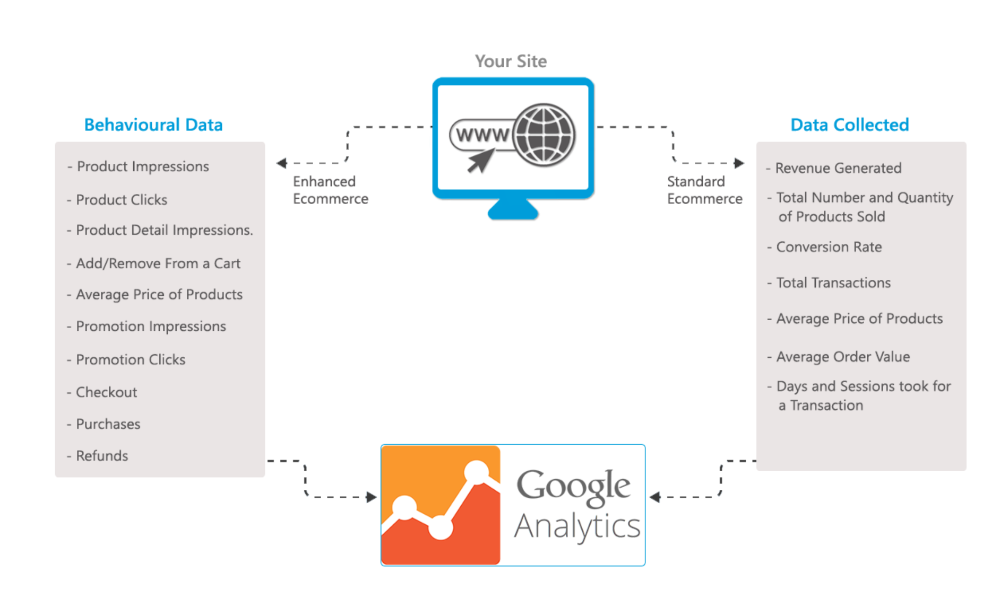

# Overview

Google Analytics offers two levels of detail in tracking ecommerce:

1. **Basic Ecommerce Tracking** that tracks only completed purchases;

1. **Enhanced Ecommerce Tracking** offers expanded tracking of user's interactions with products all through the site.

**Google Ecommerce Analytics module** allows you to use the newly launched feature of Google Analytics – Enhanced Ecommerce. You can track the user behavior across your e-commerce store starting from product views to thank you page.

The module consists of two parts:

1. Google Analytics module itself;
1. Snippets that should be added to the theme if Google Analytics functionality is needed. The Snippet file allows measuring product impressions, view product details and purchases.

Google Ecommerce Analytics Module can measure the following data:

1. **Product impressions**. The impressions action is used to record impressions of products as users see them throughout the site;
1. **View product details**. The detail action represents viewing a product detail page;
1. **Purchase**.

## Key Features

1. Quick & Easy installation;
1. Supports Enhanced Ecommerce tracking with Google Tag Manager;
1. Measure Product Impressions;
1. Measure Views of Product Details;
1. Measure Purchases.

## Documentation

* [VC Ecommerce Google Analytics Module](/docs/index.md)

* [View on Githib](https://github.com/VirtoCommerce/vc-module-google-ecommerce-analytics)

## References

* Deploy: https://virtocommerce.com/docs/latest/developer-guide/deploy-module-from-source-code/
* Installation: https://www.virtocommerce.com/docs/latest/user-guide/modules/
* Home: https://virtocommerce.com
* Community: https://www.virtocommerce.org
* [Download Latest Release](https://github.com/VirtoCommerce/vc-module-google-ecommerce-analytics/releases)
## License

Copyright (c) Virtosoftware Ltd.  All rights reserved.

Licensed under the Virto Commerce Open Software License (the "License"); you
may not use this file except in compliance with the License. You may
obtain a copy of the License at

http://virtocommerce.com/opensourcelicense

Unless required by applicable law or agreed to in writing, software
distributed under the License is distributed on an "AS IS" BASIS,
WITHOUT WARRANTIES OR CONDITIONS OF ANY KIND, either express or
implied.
