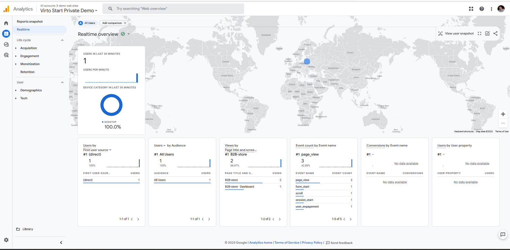
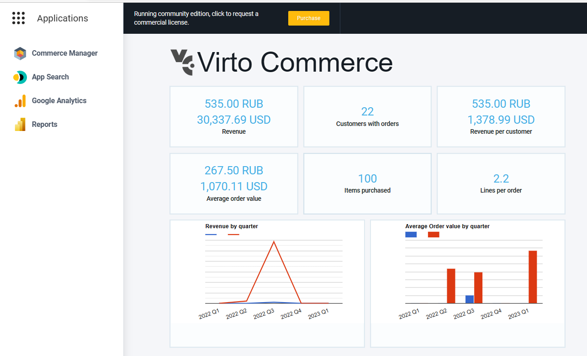

# Integration with Google Analytics 4 & Google Tag Manager
Google Analytics 4 module allows you to assign Google Analytics Measurement Id and Google Tag Manager Container Id for a Store and measure traffic, ecommerce events to collect information about the shopping behaviour of your users. 

The module supports both direct GA4 integration and advanced Google Tag Manager integration for centralized tag management.

## Key Features
1. Store Configuration.
1. Measure ecommerce with Vue B2B Theme and Virto Storefront.
1. Google Tag Manager integration for advanced tracking and tag management.
1. Ready for integration with other sales channels.
1. Application menu.

## Screenshots

## Setup

### Option 1: Direct GA4 Integration (Recommended for Simple Setups)
1. [Create Google Analytics 4 Account](https://support.google.com/analytics/answer/9304153)
1. Save your Measurement Id (format: `G-XXXXXXXXXX`)
   
   

1. Go to Store Settings in Virto Commerce Back Office
1. Find the **Google Analytics 4** section
1. Enable **GoogleAnalytics4.EnableTracking**
1. Enter your **Measurement Id** in **GoogleAnalytics4.MeasurementId**
1. Click **Save**

### Option 2: Google Tag Manager Setup for GA4 (Recommended for Advanced Tracking)

Google Tag Manager provides a centralized way to manage all your tracking tags without code changes. Use this option if you need:
- Multiple tracking tools (GA4, Facebook Pixel, LinkedIn Insight, etc.)
- Custom event tracking and triggers
- A/B testing tools
- Enhanced flexibility for marketing teams

#### Step 1: Create Google Tag Manager Container
1. [Create a Google Tag Manager account and container](https://support.google.com/tagmanager/answer/6103696)
1. Save your Container ID (format: `GTM-XXXXXXX`)

#### Step 2: Configure GA4 Tag in GTM
1. In Google Tag Manager, create a new **Google Analytics: GA4 Configuration** tag
1. Enter your GA4 Measurement ID
1. Set the trigger to **All Pages** or **Initialization - All Pages**
1. Configure any additional parameters (user properties, custom dimensions, etc.)
1. Save and publish your container

#### Step 3: Configure Virto Commerce Store Settings
1. Go to Store Settings in Virto Commerce Back Office
1. Find the **Google Analytics 4** section
1. Enable **GoogleAnalytics4.EnableTracking**
1. Enter your **GTM Container Id** in **GoogleAnalytics4.GTMContainerId** (e.g., `GTM-XXXXXXX`)
1. *(Optional)* Enter your **Measurement Id** in **GoogleAnalytics4.MeasurementId** if you want both GTM and direct GA4 tracking
1. Click **Save**

#### GTM + GA4 Integration Benefits
- **Centralized Management**: Update tracking configurations without code deployments
- **Enhanced Events**: Leverage `dataLayer` for rich ecommerce events
- **Multiple Tags**: Add other marketing and analytics tools easily
- **Testing**: Preview and debug tags before publishing
- **Load Order**: GTM loads first, ensuring proper event sequencing for all tags

#### Important Notes
- If both **GTMContainerId** and **MeasurementId** are provided, GTM will load first, followed by direct GA4
- The module automatically pushes ecommerce events to `dataLayer` which GTM can capture
- All standard ecommerce events (add_to_cart, purchase, etc.) are available in `dataLayer`

## Integration with Virto Storefront
Virto Storefront and Vue B2B Theme has native integration with Google Analytics 4 module. 
Once you click Save for Store Settings, the Google Analytics tracking will be activated.

### Supported Ecommerce Events
The module automatically tracks the following ecommerce actions and pushes them to `dataLayer`:

* **view_item** - View product details
* **select_item** - Select an item from a category
* **add_to_cart** - Add a product to shopping cart
* **remove_from_cart** - Remove a product from shopping cart
* **view_cart** - View shopping cart
* **begin_checkout** - Initiate the checkout process
* **add_shipping_info** - Add shipping information
* **add_payment_info** - Add payment information
* **purchase** - Complete purchases
* **refund** - Process refunds
* **view_promotion** - View promotions
* **select_promotion** - Apply promotions

### GTM Event Tracking (Optional Setup)
If you're using GTM, you can capture these events by creating **GA4 Event** tags in GTM:

1. In GTM, create a new **Google Analytics: GA4 Event** tag
1. Set **Configuration Tag** to your GA4 Configuration tag
1. Set **Event Name** to a custom variable that reads from `dataLayer` (e.g., `{{Event}}`)
1. Set the trigger to **Custom Event** matching the ecommerce events listed above
1. Optionally, pass additional parameters using variables from `dataLayer`
1. Save and publish your container

This allows you to:
- Customize event names before sending to GA4
- Add conditional logic to events
- Send events to multiple analytics platforms
- Debug events in GTM Preview mode

## Application Menu 
The module adds `Google Analytics` link into Application menu. It redirects to Google Analytics Dashboard. You could customize Google Analytics Dashboard Url in Platform Settings.

## Documentation
* [Google Analytics 4](https://developers.google.com/analytics/devguides/collection/ga4)
* [Google Tag Manager](https://developers.google.com/tag-platform/tag-manager)
* [GTM with GA4 Setup Guide](https://support.google.com/tagmanager/answer/9442095)
* [GA4 Ecommerce Events](https://developers.google.com/analytics/devguides/collection/ga4/ecommerce)
* [Module Documentation](https://docs.virtocommerce.org/modules/google-ecommerce-analytics/)
* [View on GitHub](docs/index.md)

## References
* Deployment: https://docs.virtocommerce.org/docs/latest/developer-guide/deploy-module-from-source-code/
* Installation: https://docs.virtocommerce.org/docs/latest/user-guide/modules/
* Home: https://virtocommerce.com
* Community: https://www.virtocommerce.org
* [Download Latest Release](https://github.com/VirtoCommerce/google-ecommerce-analytics/releases/latest)

## License
Copyright (c) Virto Solutions LTD.  All rights reserved.

This software is licensed under the Virto Commerce Open Software License (the "License"); you
may not use this file except in compliance with the License. You may
obtain a copy of the License at http://virtocommerce.com/opensourcelicense.

Unless required by the applicable law or agreed to in written form, the software
distributed under the License is provided on an "AS IS" BASIS,
WITHOUT WARRANTIES OR CONDITIONS OF ANY KIND, either express or
implied.
