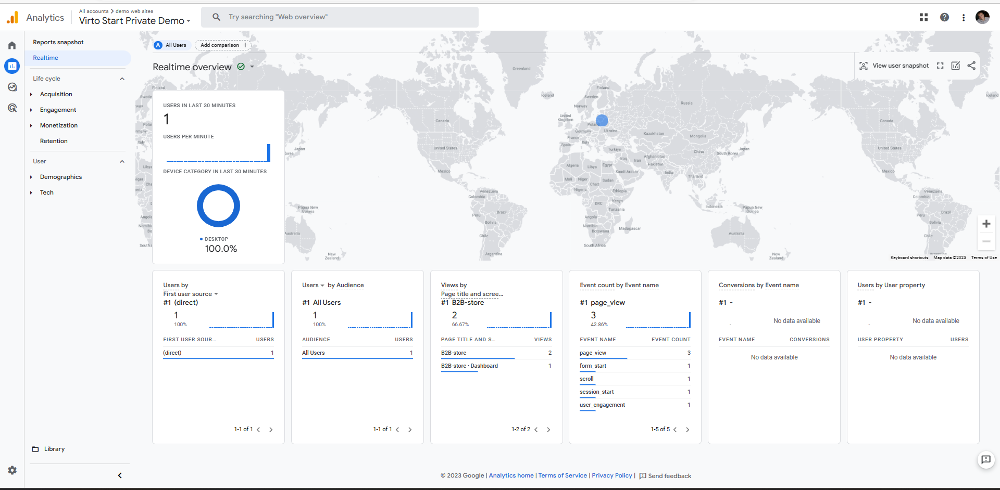
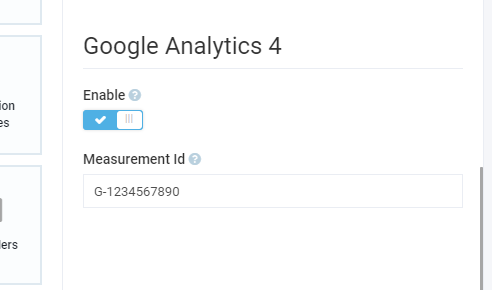
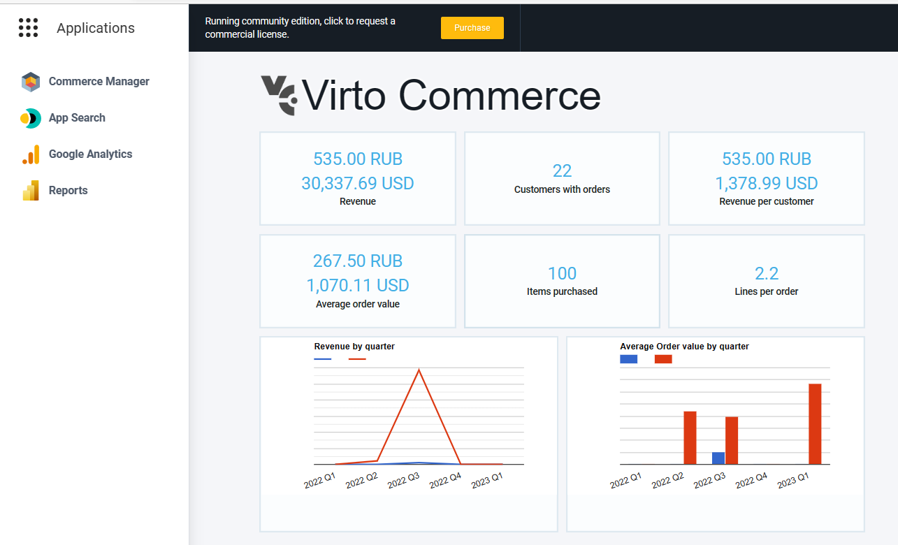

# Overview

Google Analytics 4 module allows you to assign Google Analytics Measurement Id and Google Tag Manager Container Id for a Store and measure traffic, ecommerce events to collect information about the shopping behaviour of your users.


## Key Features
1. Store Configuration.
1. Measure ecommerce with Vue B2B Theme and Virto Storefront via Google tag.
1. Google Tag Manager integration for advanced tracking and tag management.
1. Ready for integration with other sales channels.
1. Application menu.

## Screenshots


## Setup

### Google Analytics 4 Setup
First, [Create and configure Google Analytics 4 Account](https://support.google.com/analytics/answer/9304153)

Save your Measurement Id.


### Google Tag Manager Setup (Optional)
If you want to use Google Tag Manager for advanced tracking and tag management:

1. [Create a Google Tag Manager account and container](https://support.google.com/tagmanager/answer/6103696)
1. Save your Container ID (format: `GTM-XXXXXXX`)

### Configure Store Settings
1. Open Virto Commerce Back Office.
1. Select Store and Open Store Settings.
1. Find Google Analytics 4 section.
1. Enable Google Analytics tracking.
1. Enter your Measurement Id (required for GA4 tracking).
1. Enter your GTM Container Id (optional, for Google Tag Manager integration).



Once you click Save for Store, the tracking will be activated. If both Measurement Id and GTM Container Id are provided, GTM will be loaded first, followed by GA4, ensuring proper event sequencing.

## Integration with Virto Storefront
Virto Storefront and Vue B2B Theme has native integration with Google Analytics 4 module. 

We measures the following actions:

* Select an item from a category
* View product details
* Add/remove a product from a shopping cart
* Initiate the checkout process
* Make purchases or refunds
* Apply promotions

## Application Menu 
The module adds Google Analytics link into Application menu. It redirects to Google Analytics Dashboard. You could customize Google Analytics Dashboard Url in Platform Settings.



## Integration with Custom Application
You can use either Store settings or Rest API to request Google Analytics configuration for store.

## Settings
Google Analytics 4 module defines the following store settings:

1. **GoogleAnalytics4.EnableTracking** - Enable or disable tracking (applies to both GA4 and GTM)
1. **GoogleAnalytics4.MeasurementId** - Google Analytics 4 Measurement ID (e.g., `G-XXXXXXXXXX`)
1. **GoogleAnalytics4.GTMContainerId** - Google Tag Manager Container ID (e.g., `GTM-XXXXXXX`)

### Reporting (Data API) settings

These settings are **not public** — they are never returned by the anonymous `GET /api/googleanalytics/{storeId}`
endpoint. They configure *reading* from GA4 (see [Reading analytics data](#reading-analytics-data)), and are only
needed if another module consumes `IAnalyticsService`.

1. **GoogleAnalytics4.DataApi.PropertyId** - the **numeric** GA4 property id to report on (GA4 Admin > Property
   Settings > Property Details), e.g. `123456789`. This is *not* the `G-XXXXXXXXXX` measurement id.
1. **GoogleAnalytics4.DataApi.CacheTtlMinutes** - how long a successful report is cached per store and query
   (default `60`). Data API tokens are metered per property per day, so caching is a quota requirement rather than
   tuning; failed reports are cached for a fixed 60 seconds so a misconfiguration cannot burn quota.

## Reading analytics data

Besides tagging, the module can **read** GA4 through the Data API (`runReport`) and expose the result in-process as
`IAnalyticsService` (events, dimensions, filters and date ranges — no domain concepts). It has no GraphQL surface;
consumers build their own fields on top of it.

### Prerequisites

1. Set **GoogleAnalytics4.DataApi.PropertyId** for the store.
1. Enable the **Google Analytics Data API** (`analyticsdata.googleapis.com`) in the Google Cloud project the
   credential belongs to.
1. Provide credentials through **Application Default Credentials** — there is no credential setting. In a cluster
   this is workload identity or the metadata server; with a key file it is `GOOGLE_APPLICATION_CREDENTIALS`. For
   local development, the login must include the analytics scope (a plain `gcloud auth application-default login`
   does **not**, and every call then fails with `PermissionDenied`):

   ```sh
   gcloud auth application-default login --scopes="https://www.googleapis.com/auth/analytics.readonly,https://www.googleapis.com/auth/cloud-platform,https://www.googleapis.com/auth/userinfo.email,openid"
   gcloud auth application-default set-quota-project <your-gcp-project>
   ```

1. Grant the credential's principal the **Viewer** role on the GA4 property (GA4 Admin > Property access management).
1. Register any **user-scoped custom dimensions** a consumer filters on in GA4 Admin > Custom definitions.
   Registration is **not retroactive** — only events collected after it are reportable.

### What this source can and cannot answer

* GA4 processes events for up to **24-48 hours** before `runReport` can see them. "No rows" right after tagging is
  the expected state, not a fault.
* Reports are **aggregates**: the finest time dimension is `dateHour`, so every timestamp is an hour-bucket start,
  never an event time.
* Coverage is a **sample**, not a record — ad blockers and consent mode mean GA sees a subset of real activity.
* GA4 suppresses rows for small cohorts when **Google Signals** is enabled, which is exactly the shape of a
  single-customer query. A property used for per-customer reporting typically needs Signals off.


## Rest API

### Get Google Analytics Settings 

Endpoint: `/api/googleanalytics/{storeId}`

Method: `GET`

Request parameter: Store Id.

Response:

```json
{
  "enableTracking": true,
  "measurementId": "G-1234567890",
  "gtmContainerId": "GTM-XXXXXXX"
}
```

### Update Google Analytics Settings
Use Store API to provide management above Google Analytics Settings. 

### Run connection diagnostics

Endpoint: `/api/googleanalytics/{storeId}/diagnostics`

Method: `POST`, permission: `googleanalytics:access`

Runs a staged check of the reporting setup and returns one row per stage — `configuration`, `credentials`,
`apiAccess`, `customDimensions`, `reportCompatibility`, `realtime`, `processedData` — each with a `status` of
`Passed`, `Warning`, `Failed` or `Skipped`, a message naming the fix, and an optional `detail`. A failure in one of
the first three stages marks the rest `Skipped`, so the response shape never varies. Diagnostics bypasses the
response cache and reads Google directly, and never reports a credential's contents — only its kind.

The request body is optional; every field defaults, so `{}` runs a bare connectivity check:

```jsonc
{
  // user-scoped custom dimensions to verify, WITHOUT the customUser: prefix
  "userDimensionNames": ["contact_id", "organization_id", "session_kind"],
  "eventNames": ["search", "view_item", "login"],   // events you expect to be collected
  "reports": [{                                     // report shapes to compatibility-check
    "name": "searchTerms",
    "dimensionNames": ["eventName", "dateHour", "searchTerm"],
    "metricName": "eventCount",
    "eventNames": ["search", "view_search_results"]
  }],
  "includeLiveData": true                           // false skips the two data stages, saving Data API quota
}
```

Empty results are reported as `Warning`, not `Failed` — "no data yet" is a state, not a fault.

## Troubleshoting 
[Enable debug mode](https://support.google.com/analytics/answer/7201382) so you can see events in realtime and more easily troubleshoot issues.
