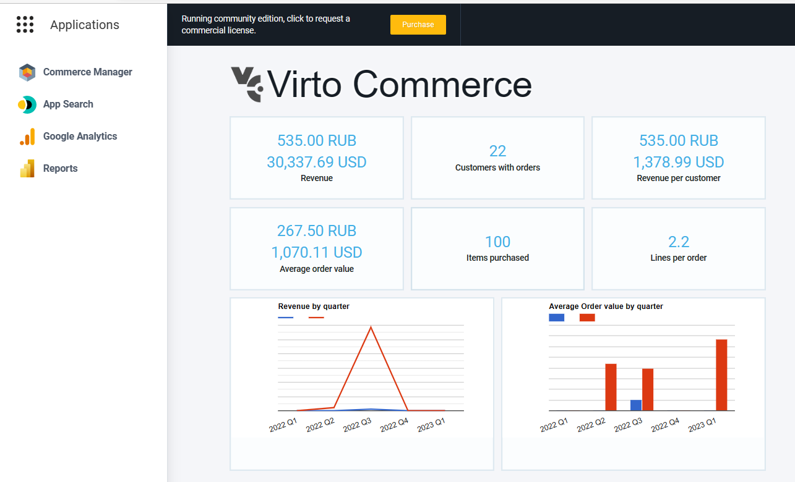

# Overview

Google Analytics 4 module allows you to assign Google Analytics Measurement Id and Google Tag Manager Container Id for a Store and measure traffic, ecommerce events to collect information about the shopping behaviour of your users.


## Key Features
1. Store Configuration.
1. Measure ecommerce with Vue B2B Theme and Virto Storefront via Google tag.
1. Google Tag Manager integration for advanced tracking and tag management.
1. Ready for integration with other sales channels.
1. Application menu.

## Screenshots


## Setup

### Google Analytics 4 Setup
First, [Create and configure Google Analytics 4 Account](https://support.google.com/analytics/answer/9304153)

Save your Measurement Id.


### Google Tag Manager Setup (Optional)
If you want to use Google Tag Manager for advanced tracking and tag management:

1. [Create a Google Tag Manager account and container](https://support.google.com/tagmanager/answer/6103696)
1. Save your Container ID (format: `GTM-XXXXXXX`)

### Configure Store Settings
1. Open Virto Commerce Back Office.
1. Select Store and Open Store Settings.
1. Find Google Analytics 4 section.
1. Enable Google Analytics tracking.
1. Enter your Measurement Id (required for GA4 tracking).
1. Enter your GTM Container Id (optional, for Google Tag Manager integration).


Once you click Save for Store, the tracking will be activated. If both Measurement Id and GTM Container Id are provided, GTM will be loaded first, followed by GA4, ensuring proper event sequencing.

## Integration with Virto Storefront
Virto Storefront and Vue B2B Theme has native integration with Google Analytics 4 module. 

We measures the following actions:

* Select an item from a category
* View product details
* Add/remove a product from a shopping cart
* Initiate the checkout process
* Make purchases or refunds
* Apply promotions

## Application Menu 
The module adds Google Analytics link into Application menu. It redirects to Google Analytics Dashboard. You could customize Google Analytics Dashboard Url in Platform Settings.



## Integration with Custom Application
You can use either Store settings or Rest API to request Google Analytics configuration for store.

## Settings
Google Analytics 4 module defines the following store settings:

1. **GoogleAnalytics4.EnableTracking** - Enable or disable tracking (applies to both GA4 and GTM)
1. **GoogleAnalytics4.MeasurementId** - Google Analytics 4 Measurement ID (e.g., `G-XXXXXXXXXX`)
1. **GoogleAnalytics4.GTMContainerId** - Google Tag Manager Container ID (e.g., `GTM-XXXXXXX`)

## Rest API

### Get Google Analytics Settings 

Endpoint: `/api/googleanalytics/{storeId}`

Method: `GET`

Request parameter: Store Id.

Response:

```json
{
  "enableTracking": true,
  "measurementId": "G-1234567890",
  "gtmContainerId": "GTM-XXXXXXX"
}
```

### Update Google Analytics Settings
Use Store API to provide management above Google Analytics Settings. 

## Troubleshoting 
[Enable debug mode](https://support.google.com/analytics/answer/7201382) so you can see events in realtime and more easily troubleshoot issues.
